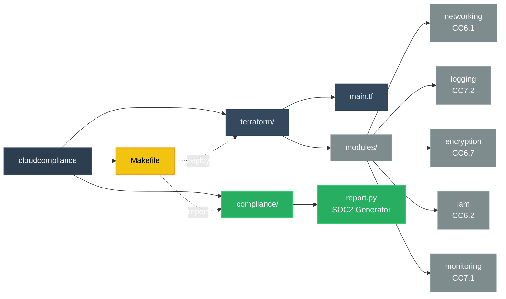

# CloudCompliance — SOC2-Ready AWS IaC

> Infrastructure as Code that provisions a SOC2 Type II-aligned AWS environment 
> in one command. Zero manual security configuration required.

## Problem
Startups spend 6–12 months retrofitting SOC2 controls onto existing infrastructure.
This IaC eliminates that retrofit — every control is provisioned at creation time.

## SOC2 Control Coverage

| Control | Title                        | Status        |
|---------|------------------------------|---------------|
| CC6.1   | Network Isolation            | ✅ Implemented |
| CC6.2   | Authentication Controls      | ✅ Implemented |
| CC6.7   | Encryption at rest/transit   | ✅ Implemented |
| CC7.1   | Threat Detection             | ✅ Implemented |
| CC7.2   | Audit Logging                | ✅ Implemented |

## What Gets Provisioned

- **Networking** — Private VPC, no public subnets, deny-all security group
- **Logging** — Tamper-proof audit bucket, versioning, delete protection
- **Encryption** — KMS customer-managed key, S3 encryption, HTTPS-only policy
- **IAM** — 14-char password policy, 90-day rotation, least-privilege role, root alerts
- **Monitoring** — CloudWatch alarms for root login and public bucket detection

## Quick Start

**Requirements:** Terraform, Docker, LocalStack

```bash
# Start LocalStack
docker run --rm -d -p 4566:4566 localstack/localstack:3.4.0

# Deploy everything
make deploy

# Generate SOC2 compliance report
make report
```

## Architecture
```
cloudcompliance/
├── terraform/
│   ├── main.tf
│   └── modules/
│       ├── networking/    # CC6.1 — VPC, private subnets
│       ├── logging/       # CC7.2 — Audit bucket
│       ├── encryption/    # CC6.7 — KMS, encrypted S3
│       ├── iam/           # CC6.2 — Password policy, roles
│       └── monitoring/    # CC7.1 — CloudWatch alarms
├── compliance/
│   └── report.py          # SOC2 evidence generator
└── Makefile               # make deploy / report / destroy
```
## Chart



## Compliance Report Output

Running `make report` generates a terminal report + `compliance_report.json`
mapping every provisioned resource to its SOC2 Trust Service Criteria.

## Standards Referenced

- AICPA SOC2 Trust Services Criteria 2017
- CIS AWS Foundations Benchmark v2.0
- NIST SP 800-53 Rev 5
- AWS Security Reference Architecture 2023

## Tech Stack

Terraform · AWS (LocalStack) · Python · KMS · IAM · CloudWatch · SNS
